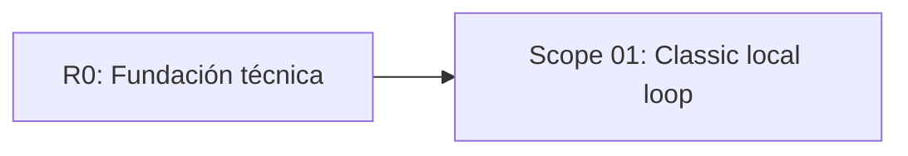

# EXPANSION: R1 - MVP local

> **Status:** Completed  
> [← README.md](README.md)

## Scope Summary

| # | Scope | SDLC Phase(s) | Depends On | Status |
|---|---|---|---|---|
| 01 | Classic local loop | R / S / V / T | R0 | DONE |

## Dependency Map

## Impact per SDLC Phase

| Phase Code | Affected? | What changes |
|---|---|---|
| R | ☑ | Reglas MVP local |
| S | ☑ | Pantallas de partida y resultado |
| V | ☑ | Dominio, aplicación y UI de Classic |
| T | ☑ | Unit tests y smoke/e2e |
| W | ☑ | Seguimiento de planificación |

## Notes

R1 fue ejecutado en `feature/r1-local-mvp`. No incluye ranking, monedas, power-ups, backend ni login.
