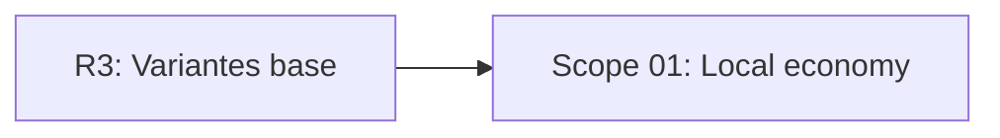

# EXPANSION: R4 - Economía local

> **Status:** Expansion written, not executed  
> [← README.md](README.md)

## Scope Summary

| # | Scope | SDLC Phase(s) | Depends On | Status |
|---|---|---|---|---|
| 01 | Local economy | R / S / M / V / T | R3 | PENDING |

## Dependency Map

## Impact per SDLC Phase

| Phase Code | Affected? | What changes |
|---|---|---|
| R | ☑ | Reglas de monedas, power-ups y continuaciones |
| S | ☑ | Tienda, resultado con marcas y mejoras |
| M | ☑ | Saldo e historial local |
| V | ☑ | Economía local e integración con partida |
| T | ☑ | Tests de cobro, gasto y penalizaciones |
| W | ☑ | Seguimiento de planificación |

## Notes

R4 debe preparar reglas de elegibilidad para no rehacer score/ranking en R5.

