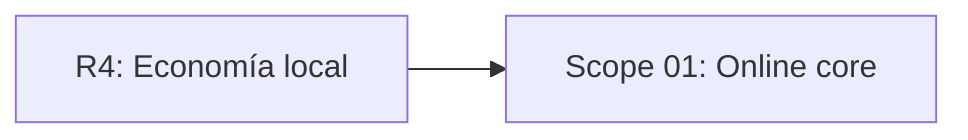

# EXPANSION: R5 - Online core

> **Status:** Expansion written, not executed  
> [← README.md](README.md)

## Scope Summary

| # | Scope | SDLC Phase(s) | Depends On | Status |
|---|---|---|---|---|
| 01 | Online core | R / S / M / V / T / B | R4 | PENDING |

## Dependency Map

## Impact per SDLC Phase

| Phase Code | Affected? | What changes |
|---|---|---|
| R | ☑ | Cuenta, ranking online y validación |
| S | ☑ | Login, envío y ranking online |
| M | ☑ | Perfil, partidas, submissions y ranking |
| V | ☑ | API Go y cliente web |
| T | ☑ | Validación, contrato y smoke e2e |
| B | ☑ | Staging/mock contractual |
| W | ☑ | Seguimiento de planificación |

## Notes

Daily, rankings para todos los modos y sincronización offline completa quedan fuera de R5.

