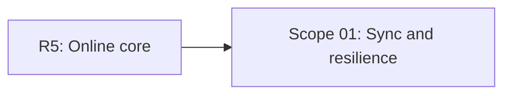

# EXPANSION: R6 - Sincronización y resiliencia

> **Status:** Expansion written, not executed  
> [← README.md](README.md)

## Scope Summary

| # | Scope | SDLC Phase(s) | Depends On | Status |
|---|---|---|---|---|
| 01 | Sync and resilience | R / S / M / V / T / O | R5 | PENDING |

## Dependency Map

## Impact per SDLC Phase

| Phase Code | Affected? | What changes |
|---|---|---|
| R | ☑ | Offline-online, recompensas y estados |
| S | ☑ | UI de sincronización y fallos |
| M | ☑ | Cola, ledger, rewards y proyecciones |
| V | ☑ | Idempotencia y reintentos |
| T | ☑ | Tests de duplicados y recuperación |
| O | ☑ | Rate limiting y degradación |
| W | ☑ | Seguimiento de planificación |

## Notes

R6 es la base para Daily y features recurrentes confiables.

