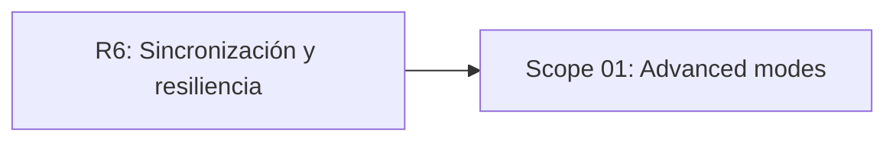

# EXPANSION: R7 - Modos avanzados

> **Status:** Expansion written, not executed  
> [← README.md](README.md)

## Scope Summary

| # | Scope | SDLC Phase(s) | Depends On | Status |
|---|---|---|---|---|
| 01 | Advanced modes | R / S / V / T | R6 | PENDING |

## Dependency Map

## Impact per SDLC Phase

| Phase Code | Affected? | What changes |
|---|---|---|
| R | ☑ | Reglas de modos avanzados |
| S | ☑ | UX, tutoriales y animaciones específicas |
| V | ☑ | Motor extensible por modo |
| T | ☑ | Tests de reglas, eventos y paridad |
| W | ☑ | Seguimiento de planificación |

## Notes

Los modos avanzados deben mantener legibilidad del tablero aunque agreguen complejidad visual.

