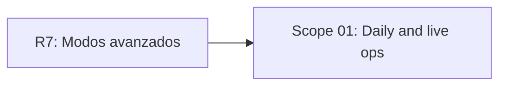

# EXPANSION: R8 - Daily y live ops

> **Status:** Expansion written, not executed  
> [← README.md](README.md)

## Scope Summary

| # | Scope | SDLC Phase(s) | Depends On | Status |
|---|---|---|---|---|
| 01 | Daily and live ops | R / S / M / V / T / O / N | R7 | PENDING |

## Dependency Map

## Impact per SDLC Phase

| Phase Code | Affected? | What changes |
|---|---|---|
| R | ☑ | Daily, rachas y recompensas recurrentes |
| S | ☑ | UI Daily y elegibilidad |
| M | ☑ | Estado usuario/fecha y rankings diarios |
| V | ☑ | Backend y frontend live ops |
| T | ☑ | Reproducibilidad y ranking |
| O | ☑ | Configuración remota |
| N | ☑ | Métricas de Daily y participación |
| W | ☑ | Seguimiento de planificación |

## Notes

Daily competitivo requiere servidor autoritativo y reglas claras de elegibilidad.

