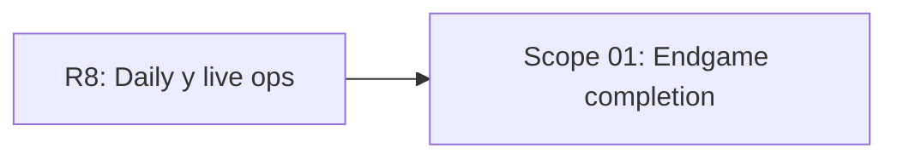

# EXPANSION: R9 - Endgame

> **Status:** Expansion written, not executed  
> [← README.md](README.md)

## Scope Summary

| # | Scope | SDLC Phase(s) | Depends On | Status |
|---|---|---|---|---|
| 01 | Endgame completion | R / S / M / V / T / B / O / N / F | R8 | PENDING |

## Dependency Map

## Impact per SDLC Phase

| Phase Code | Affected? | What changes |
|---|---|---|
| R | ☑ | Progresión, logros, tienda, rankings y balance |
| S | ☑ | Polish visual, accesibilidad y replays |
| M | ☑ | Proyecciones, puzzles, logros y rankings completos |
| V | ☑ | Implementación completa de sistemas restantes |
| T | ☑ | Playwright e2e completo y pruebas de balance |
| B | ☑ | Release candidate y promoción |
| O | ☑ | Backups, restore, rollback y soporte |
| N | ☑ | Logs, métricas y trazas |
| F | ☑ | Feedback de beta y ajustes |
| W | ☑ | Seguimiento de planificación |

## Notes

R9 debe separar claramente “listo para 1.0.0” de mejoras futuras.

