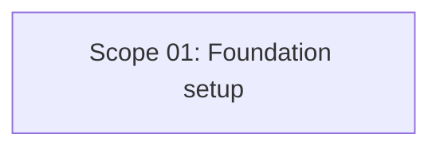

# EXPANSION: R0 - Fundación técnica

> **Status:** Completed  
> [← README.md](README.md)

## Scope Summary

| # | Scope | SDLC Phase(s) | Depends On | Status |
|---|---|---|---|---|
| 01 | Foundation setup | S / V / T / B / W | — | DONE |

## Dependency Map

## Impact per SDLC Phase

| Phase Code | Affected? | What changes |
|---|---|---|
| S | ☑ | Base visual, jerarquía de UI y estructura de componentes |
| V | ☑ | Scaffold React/Vite, Tailwind, Anime.js, capas por feature |
| T | ☑ | Scripts iniciales de lint, typecheck y pruebas |
| B | ☑ | Pre-commit y preparación de CI |
| W | ☑ | Seguimiento de planificación |

## Notes

R0 fue autorizado explícitamente por el usuario y ejecutado. El hook de pre-commit existe en `.githooks/pre-commit` y `core.hooksPath` quedó configurado hacia `.githooks`.
