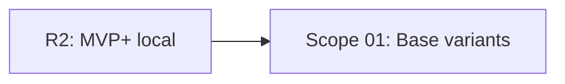

# EXPANSION: R3 - Variantes base

> **Status:** DONE  
> [← README.md](README.md)

## Scope Summary

| # | Scope | SDLC Phase(s) | Depends On | Status |
|---|---|---|---|---|
| 01 | Base variants | R / S / V / T | R2 | DONE |

## Dependency Map

## Impact per SDLC Phase

| Phase Code | Affected? | What changes |
|---|---|---|
| R | ☑ | Reglas de Dimensional, Time Attack y Move Limit |
| S | ☑ | Selección de modo y configuración |
| V | ☑ | Motor parametrizable por modo |
| T | ☑ | Tests de límites y configuraciones |
| W | ☑ | Seguimiento de planificación |

## Notes

R3 prepara la base para economía local y rankings por configuración.

